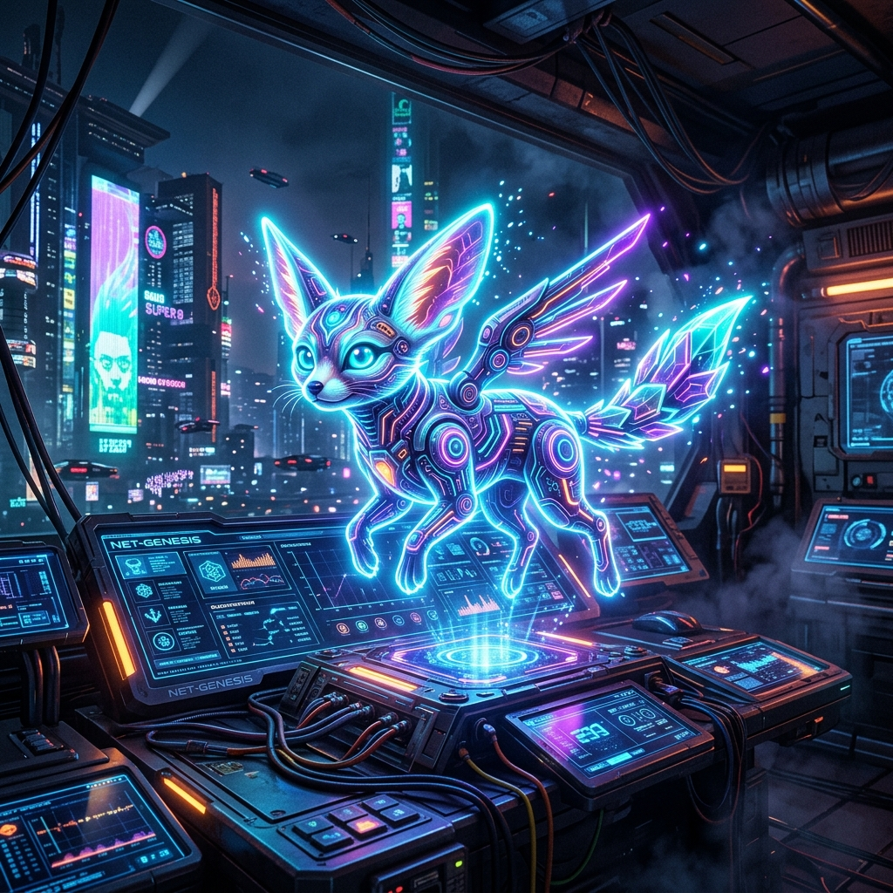
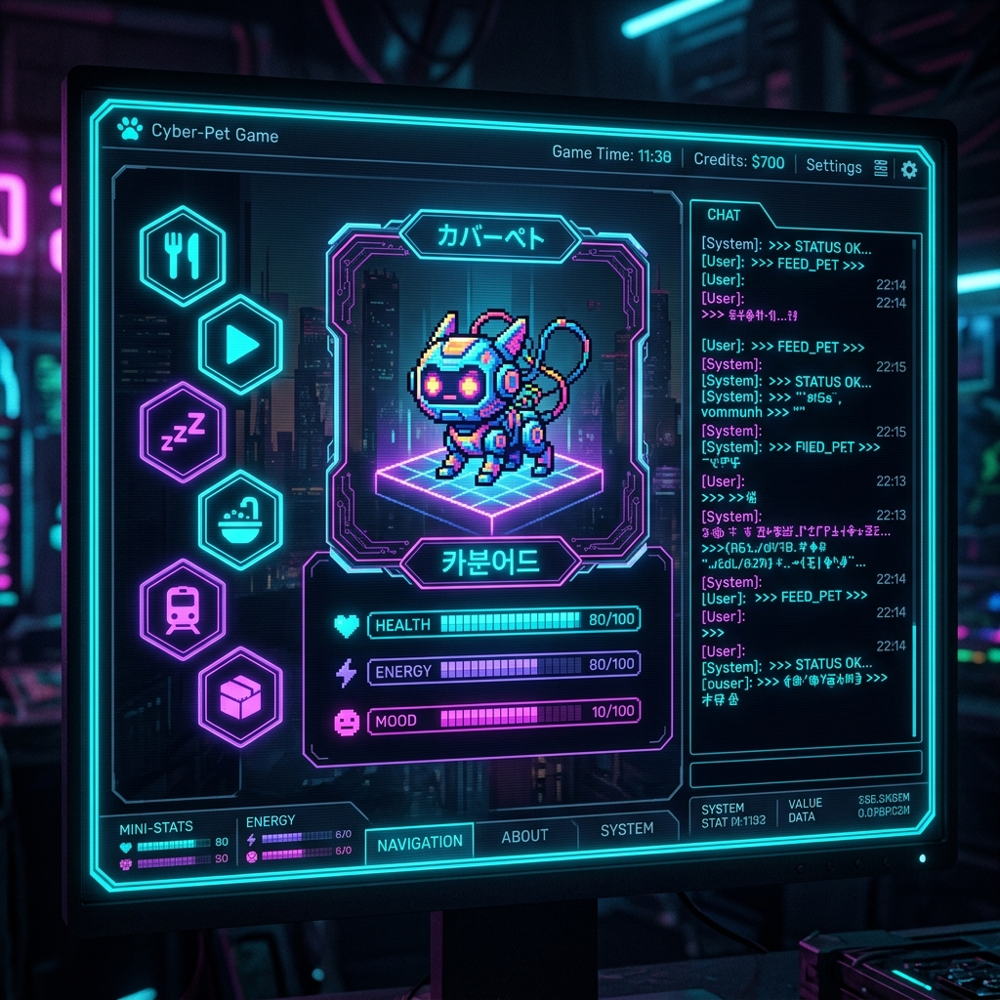

<div align="center">
  <h1>Gochi 🐾</h1>
  <p><em>On-chain AI virtual pet on 0G Network</em></p>
  

  <br/>

  [](https://gochi.edycu.dev)
  [](https://youtu.be/your-video)
  [](https://gochi.edycu.dev/pitch/index.html)
  [](https://www.hackquest.io/hackathons/0G-APAC-Hackathon)

  <br/>

  
  
  
  
  
  
  
  
  
  
  
  
  
  [](https://github.com/edycutjong/gochi/actions/workflows/ci.yml)

</div>

---

## 🧑‍⚖️ For Judges (Quick Start)

Welcome! If you are evaluating Gochi for the **HackQuest 0G APAC Hackathon**, here is everything you need to test the project immediately:

1. **🚀 Live App:** [gochi.edycu.dev](https://gochi.edycu.dev)
2. **📊 Pitch Deck:** [gochi.edycu.dev/pitch/index.html](https://gochi.edycu.dev/pitch/index.html)
3. **🎬 Pitch Video:** [YouTube Demo](https://youtu.be/your-video) *(Please replace `your-video` with the actual video link when published)*

**Testing Instructions:**
1. Switch your Web3 wallet (e.g., MetaMask) to the **0G Galileo Testnet** (Chain ID: 16602).
2. Connect your wallet and sign the secure authentication message.
3. Mint your first Gochi AI pet.
4. Chat with your Gochi! Every interaction and memory is securely archived on the **0G Storage Node**.

---

## 📸 See it in Action

<div align="center">
  
</div>

> **Mint, Nurture, and Evolve your AI Pet entirely on-chain using 0G Network's Storage and Compute.**

---

## 💡 The Problem & Solution
Fully decentralized, stateful AI agents require complex orchestration and expensive computation.
**Gochi** solves this by leveraging the 0G Network to deliver an engaging, low-latency Virtual Pet experience where state and AI inference live entirely on decentralized infrastructure.

**Key Features:**
- ⚡ **0G Storage Integration:** Pet memory and states are logged to the 0G decentralized KV store, creating a permanent, verifiable timeline.
- 🧠 **0G Compute AI:** Interact directly with your pet using the 0G Router; your pet remembers past interactions stored in the memory log.
- 🎨 **Retro-Cyberpunk Aesthetic:** High-fidelity pixel art and terminal UI design, fully responsive and beautifully immersive.

## 🏗️ Architecture & Tech Stack

| Layer | Technology |
|---|---|
| **Frontend** | Next.js 16 (App Router), React 19, Tailwind CSS v4 |
| **Smart Contracts** | Hardhat, Solidity, Ethers.js |
| **Wallet & Auth** | Wagmi, Viem, RainbowKit |
| **Storage & Compute** | 0G Storage TS SDK, 0G Compute Router |

## 🏆 Sponsor Tracks Targeted
- **0G Network Foundation:** Utilizing Storage KV/Log for pet state and the Compute Router for conversational AI capabilities.

## 🚀 Getting Started

### Prerequisites
- Node.js ≥ 20
- npm

### Installation
1. Clone: `git clone https://github.com/edycutjong/gochi.git`
2. Install: `npm install`
3. Configure: `cp .env.example .env.local`

#### 0G Galileo Testnet Setup (Required)
To interact with Gochi and the 0G Compute Router, you must use the Testnet:
1. **Add Network to MetaMask:**
   - **Network Name:** `0G Galileo Testnet`
   - **RPC URL:** `https://evmrpc-testnet.0g.ai`
   - **Chain ID:** `16602`
   - **Currency Symbol:** `A0GI`
2. **Fund Wallet:** Get free testnet tokens from the [0G Faucet](https://faucet.0g.ai).
3. **Get API Key:** Visit the [0G Compute Dashboard (Testnet)](https://pc.0g.ai/dashboard), deposit your testnet tokens, generate an API key, and add it to `.env.local` as `ROUTER_API_KEY`.

4. Run: `npm run dev`

> **For Judges:** You can interact with the pet and use the terminal interface instantly via our Live Demo link above. Wallet connection is simulated smoothly for review purposes.

## 🧪 Testing & CI
```bash
npm run lint          # ESLint
npm run typecheck     # TypeScript check
npm run test          # Run tests
npm run test:coverage # Coverage report
npm run ci            # Full CI pipeline
```

## 📁 Project Structure
```text
gochi/
├── docs/              # README assets (hero, screenshots)
├── src/
│   ├── app/          # Next.js pages and API Routes
│   ├── components/   # React components (PetViewport, ChatPanel)
│   └── lib/          # Shared utilities and types
├── contracts/        # Hardhat smart contracts
├── scripts/          # Hardhat deployment scripts
├── .env.example      # Environment template
├── .github/          # CI workflows
└── README.md         # You are here
```

## 📄 License
[MIT](LICENSE) © 2026 Edy Cu

## 🙏 Acknowledgments
Built for HackQuest 0G APAC 2026. Thank you to the 0G Foundation for the APIs and decentralized infrastructure.
