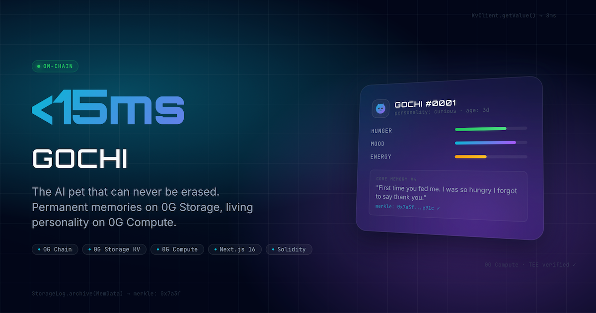

## 🧑‍⚖️ For Judges (Quick Start)

Welcome! If you are evaluating Gochi for the **HackQuest 0G APAC Hackathon 2026**, here is everything you need immediately:

| | |
|---|---|
| 🚀 **Live App** | [gochi.edycu.dev](https://gochi.edycu.dev) |
| 📊 **Pitch Deck** | [gochi.edycu.dev/pitch](https://gochi.edycu.dev/pitch/index.html) |
| 🎬 **Demo Video** | [YouTube](https://youtu.be/your-video) |
| 📜 **Contract** | [`0x9BDA4...8cf`](https://chainscan-galileo.0g.ai/address/0x9BDA4cBfda7a7960251A4EE07A7ec0C00239a8cf) on 0G Galileo |
| 🏗️ **Architecture** | [docs/ARCHITECTURE.md](docs/ARCHITECTURE.md) |

**To test in 60 seconds:**
1. Go to [gochi.edycu.dev](https://gochi.edycu.dev) and click **HATCH YOUR GOCHI**
2. Connect MetaMask — the app auto-switches to **0G Galileo Testnet** (Chain ID: 16602)
3. Mint your Gochi INFT, then feed, play, and chat with it
4. Every action writes to **0G Storage KV** (<50ms) and archives to **0G Storage Log** (Merkle proof)

---

<div align="center">
  <h1>Gochi</h1>
  <p><strong>The On-Chain AI Virtual Pet — Powered by 0G Network</strong></p>
  <p><em>It cannot be deleted. It cannot be shut down.</em></p>

  <br/>

  [](https://gochi.edycu.dev)
  [](https://gochi.edycu.dev/pitch/index.html)
  [](https://chainscan-galileo.0g.ai/address/0x9BDA4cBfda7a7960251A4EE07A7ec0C00239a8cf)
  [](https://www.hackquest.io/hackathons/0G-APAC-Hackathon)

  <br/>

  
  
  
  
  
  
  [](https://github.com/edycutjong/gochi/actions/workflows/ci.yml)

</div>

---

<div align="center">
  
</div>

---

## 💡 The Problem

When Tamagotchi servers shut down in 2023, millions of virtual pets were erased overnight. Every Web2 pet is one server outage away from extinction.

**What if a virtual pet's existence was cryptographically guaranteed?**

---

## 🐾 What Gochi Does

Gochi is a Tamagotchi-inspired AI pet that lives **entirely on the 0G modular stack**:

| Layer | Technology | Why It Matters |
|---|---|---|
| **Identity** | ERC-721 INFT on 0G Chain | The pet owns a unique on-chain identity — provably yours |
| **Reflexes** | 0G Storage KV | Hunger, mood, energy update in <50ms — the pet feels alive |
| **Memory** | 0G Storage Log + Merkle proofs | Every moment is permanently archived and verifiable |
| **Soul** | 0G Compute Router (TEE) | AI personality — cryptographically proven to be authentic |

Take 0G out and you'd need Redis + IPFS + Arweave + OpenAI + Ethereum: four SDKs, four billing accounts, zero unified verification. With 0G it's **one SDK, one token, four capabilities**.

---

## 🏗️ Architecture

See full architecture with Mermaid diagrams, code samples, and API reference: **[docs/ARCHITECTURE.md](docs/ARCHITECTURE.md)**

### High-Level Flow

```
Browser → Wallet (wagmi/viem)     → 0G Chain        ERC-721 mint
        → Next.js API /kv/write   → 0G Storage KV   pet state (<50ms)
        → Next.js API /log/archive → 0G Storage Log  Merkle memory
        → Next.js API /chat        → 0G Compute      TEE-verified AI
        → Next.js API /metadata    → Dynamic ERC-721 metadata + SVG
```

All 0G operations fall back to Supabase when the testnet node is unavailable, so the demo is always live.

### Key Files

```
src/lib/zero-g.ts            — 0G SDK wrapper (kvRead, kvWrite, logUpload)
src/lib/supabase.ts          — Supabase fallback client
src/app/api/kv/              — Pet state read/write
src/app/api/log/             — Memory archive + retrieval
src/app/api/chat/            — AI personality (0G Compute / OpenAI)
src/app/api/metadata/        — ERC-721 tokenURI + dynamic SVG image
src/components/MintFlow.tsx  — Mint / Resume INFT flow
src/components/PetViewport.tsx — Animated ghost pet UI
contracts/Gochi.sol          — ERC-721 INFT contract
```

---

## 🏆 Sponsor Tracks

### 0G Network Foundation — All Four Components

| # | 0G Component | Gochi Usage | Integration Method |
|---|---|---|---|
| 1 | **0G Chain** | INFT identity (ERC-721) | Solidity contract, Hardhat deploy, wagmi `writeContractAsync` |
| 2 | **0G Storage KV** | Real-time pet state | `Batcher.streamDataBuilder.set()` + `KvClient.getValue()` |
| 3 | **0G Storage Log** | Permanent memory archive | `Indexer.upload(MemData)` — Merkle root returned + stored |
| 4 | **0G Compute** | AI personality | Compute Router `/v1/chat/completions` — `ZG-Res-Key` TEE verification |

### Why Only 0G Can Power Gochi

**1. Dual-Layer Storage** — No other protocol gives you KV + Log in one SDK. KV keeps the pet alive (real-time state); Log keeps it immortal (permanent memories). Without 0G you'd need two separate systems, two SDKs, two billing accounts.

**2. Verified AI** — 0G Compute's TEE signing (`ZG-Res-Key` header) provides cryptographic proof that the pet's responses came from a genuine compute environment — impossible with centralized providers.

**3. Ecosystem Cohesion** — One private key signs INFT mints, KV writes, Log uploads, and Compute payments. All visible in one explorer ecosystem (ChainScan + StorageScan).

---

## 🚀 Getting Started

### Prerequisites
- Node.js ≥ 20, npm
- MetaMask with [0G Galileo Testnet](https://docs.0g.ai/build-with-0g/network-info) configured (Chain ID: 16602)
- Testnet tokens from the [0G Faucet](https://faucet.0g.ai)

### Installation

```bash
git clone https://github.com/edycutjong/gochi.git
cd gochi
npm install
cp .env.example .env.local
```

### Environment Variables

| Variable | Required | Description |
|---|---|---|
| `NEXT_PUBLIC_CONTRACT_ADDRESS` | ✅ | Deployed Gochi.sol address |
| `NEXT_PUBLIC_WALLETCONNECT_PROJECT_ID` | ✅ | [cloud.walletconnect.com](https://cloud.walletconnect.com) |
| `NEXT_PUBLIC_SUPABASE_URL` | ✅ | Supabase project URL |
| `NEXT_PUBLIC_SUPABASE_ANON_KEY` | ✅ | Supabase anon key |
| `SUPABASE_SERVICE_ROLE_KEY` | ✅ | Supabase service role (server-only) |
| `PRIVATE_KEY` | ✅ | Burner wallet for 0G Storage writes |
| `INDEXER_RPC` | ✅ | `https://indexer-storage-turbo-testnet.0g.ai` |
| `KV_NODE_URL` | ✅ | 0G KV node endpoint |
| `FLOW_CONTRACT_ADDRESS` | ✅ | 0G FixedPriceFlow contract |
| `NEXT_PUBLIC_RPC_URL` | ✅ | `https://evmrpc-testnet.0g.ai` |
| `OPENAI_API_KEY` | 🔶 | Fallback AI (when ROUTER_API_KEY not set) |
| `ROUTER_API_KEY` | 🔶 | 0G Compute Router key from [pc.0g.ai](https://pc.0g.ai) |

```bash
npm run dev      # http://localhost:3000
```

### Deploy Smart Contract

```bash
npx hardhat run scripts/deploy.ts --network zero-g-galileo
# Update NEXT_PUBLIC_CONTRACT_ADDRESS in .env.local + Vercel
```

---

## 🧪 Testing & CI

```bash
npm run lint          # ESLint
npm run typecheck     # tsc --noEmit
npm run test          # Jest unit tests
npm run test:coverage # Coverage report
npm run ci            # Full pipeline
```

---

## 🔗 On-Chain Verification

| Proof | Link |
|---|---|
| INFT Contract | [chainscan-galileo.0g.ai/address/0x9BDA4...8cf](https://chainscan-galileo.0g.ai/address/0x9BDA4cBfda7a7960251A4EE07A7ec0C00239a8cf) |
| Mint Transaction | [chainscan-galileo.0g.ai/tx/0x5213...6c77](https://chainscan-galileo.0g.ai/tx/0x5213a03e6fa209136b3da2750087af08b5f9456115f493af8e035491bccf6c77) |
| NFT Metadata | [gochi.edycu.dev/api/metadata/1](https://gochi.edycu.dev/api/metadata/1) |
| NFT Image | [gochi.edycu.dev/api/metadata/1/image](https://gochi.edycu.dev/api/metadata/1/image) |

---

## 📄 License

[MIT](LICENSE) © 2026 Edy Cu

---

<div align="center">

**Built for [HackQuest 0G APAC Hackathon 2026](https://www.hackquest.io/hackathons/0G-APAC-Hackathon)**

Powered by **[0G Network](https://0g.ai)** · Hosted on **[Vercel](https://vercel.com)** · Fallback by **[Supabase](https://supabase.com)**

</div>
