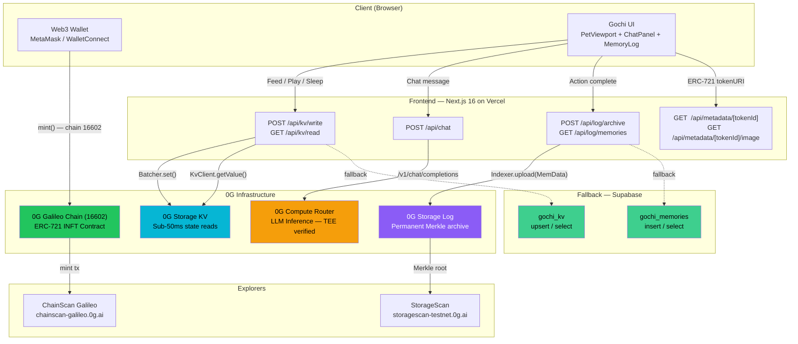

# Gochi — Technical Architecture

> **Deployed:** [gochi.edycu.dev](https://gochi.edycu.dev) · **Network:** 0G Galileo Testnet (Chain ID: 16602) · **Contract:** [`0x9BDA4cBfda7a7960251A4EE07A7ec0C00239a8cf`](https://chainscan-galileo.0g.ai/address/0x9BDA4cBfda7a7960251A4EE07A7ec0C00239a8cf)

---

## Overview

Gochi is a Tamagotchi-inspired AI virtual pet that lives **entirely on the 0G modular stack**. Unlike Web2 pets that die when a server shuts down, Gochi is cryptographically immortal — its identity is an INFT on 0G Chain, its real-time reflexes run through 0G Storage KV, its memories are permanently archived on 0G Storage Log with Merkle proofs, and its personality is powered by 0G Compute.

---

## System Architecture



---

## Tech Stack

| Layer | Technology | Purpose |
|---|---|---|
| **Frontend** | Next.js 16 (App Router), React 19 | Server-rendered UI + API routes |
| **Styling** | Tailwind CSS v4 | Cyberpunk neon aesthetic, responsive layout |
| **Chain** | 0G Galileo Testnet (Chain ID: 16602) | Live on-chain INFT proof |
| **Wallet** | wagmi v3 + viem v2 + WalletConnect | EVM wallet connection, chain switching |
| **Storage KV** | `@0gfoundation/0g-storage-ts-sdk` (Batcher + KvClient) | Real-time pet state (<50ms round trip) |
| **Storage Log** | `@0gfoundation/0g-storage-ts-sdk` (MemData + Indexer) | Permanent memory archival with Merkle proofs |
| **Compute** | 0G Compute Router (OpenAI-compatible) + OpenAI fallback | AI personality, TEE-verified responses |
| **NFT** | Custom ERC-721 (Solidity), Hardhat | INFT minting on 0G Galileo |
| **Fallback DB** | Supabase (PostgreSQL) | State + memory persistence when 0G node unavailable |
| **Deploy** | Vercel | Zero-config frontend hosting |

---

## 0G Integration — 4 Components

### 1. 0G Chain — INFT Identity

**Contract**: `0x9BDA4cBfda7a7960251A4EE07A7ec0C00239a8cf` on Chain ID 16602  
**Explorer**: [chainscan-galileo.0g.ai](https://chainscan-galileo.0g.ai/address/0x9BDA4cBfda7a7960251A4EE07A7ec0C00239a8cf)

Each Gochi is minted as an ERC-721 token. The contract stores a deterministic `personalitySeed` (derived from `keccak256(owner, blockTimestamp, tokenId)`) and `birthTimestamp` on-chain. Token metadata is served dynamically by the Next.js backend at `/api/metadata/[tokenId]`.

```solidity
function mint() external returns (uint256) {
    _tokenIds++;
    uint256 newId = _tokenIds;
    bytes32 seed = keccak256(abi.encodePacked(msg.sender, block.timestamp, newId));
    _safeMint(msg.sender, newId);
    personalitySeed[newId] = seed;
    birthTimestamp[newId] = block.timestamp;
    emit GochiMinted(newId, msg.sender, seed);
    return newId;
}
```

**Client flow** (`src/components/MintFlow.tsx`):
```typescript
await switchChainAsync({ chainId: 16602 });  // enforce correct network
const hash = await writeContractAsync({
  address: process.env.NEXT_PUBLIC_CONTRACT_ADDRESS,
  abi: GOCHI_ABI,
  functionName: 'mint',
  chainId: 16602,
});
// GochiMinted event decoded via decodeEventLog (viem) to extract tokenId
```

---

### 2. 0G Storage KV — Real-Time Pet State

**SDK**: `@0gfoundation/0g-storage-ts-sdk` — `Batcher`, `KvClient`, `Indexer.selectNodes()`  
**Route**: `POST /api/kv/write`, `GET /api/kv/read`

Pet stats (hunger, mood, energy) are stored under the key `gochi:{tokenId}` in a fixed stream namespace. Writes go through the 0G Batcher; reads use KvClient's direct lookup. Supabase `gochi_kv` acts as the fallback when the 0G node is unavailable.

```typescript
// WRITE (src/lib/zero-g.ts)
const indexer = new Indexer(INDEXER_RPC);
const [nodes] = await indexer.selectNodes(1);
const batcher = new Batcher(1, nodes, flowContract, RPC_URL);
batcher.streamDataBuilder.set(
  STREAM_ID,
  Uint8Array.from(Buffer.from(key, 'utf-8')),
  Uint8Array.from(Buffer.from(JSON.stringify(value), 'utf-8'))
);
const [result] = await batcher.exec();

// READ
const client = new KvClient(KV_NODE_URL);
const raw = await client.getValue(STREAM_ID, Buffer.from(key, 'utf-8'));
const state = JSON.parse(Buffer.from(raw.data).toString('utf-8'));
```

**Stream namespace** (fixed bytes32 key):
```
STREAM_ID = keccak256("gochi_v1")
           = 0x676f636869...0001
```

---

### 3. 0G Storage Log — Permanent Memory Archive

**SDK**: `@0gfoundation/0g-storage-ts-sdk` — `MemData`, `Indexer.upload()`  
**Route**: `POST /api/log/archive`, `GET /api/log/memories`

Every significant action (feed, play, sleep, chat) is serialized to JSON, encoded as `MemData`, and uploaded to 0G Storage Log. The returned Merkle root is stored alongside the memory record in Supabase for fast retrieval and display in the UI.

```typescript
// ARCHIVE (src/app/api/log/archive/route.ts)
const payload = { gochiId: tokenId, event: 'FEED', title, timestamp: Date.now() };
const encoded = new TextEncoder().encode(JSON.stringify(payload));
const memData = new MemData(encoded);
const [result] = await indexer.upload(memData, RPC_URL, signer);
// result.rootHash → Merkle root, viewable on StorageScan
// result.txHash   → upload tx, viewable on ChainScan
```

Each memory record returned by `/api/log/memories` includes the Merkle root and transaction hash for independent on-chain verification.

---

### 4. 0G Compute — AI Personality Engine

**API**: 0G Compute Router (OpenAI-compatible `/v1/chat/completions`)  
**Route**: `POST /api/chat`  
**TEE verification**: `ZG-Res-Key` response header

Gochi's chat responses are generated by an LLM running in 0G Compute's TEE environment. The presence of the `ZG-Res-Key` header in the response cryptographically proves the inference ran in a genuine trusted execution environment — not a mocked API.

```typescript
const response = await fetch(ROUTER_URL + '/v1/chat/completions', {
  method: 'POST',
  headers: { Authorization: `Bearer ${ROUTER_API_KEY}` },
  body: JSON.stringify({
    model: 'qwen/qwen-2.5-7b-instruct',
    messages: [
      { role: 'system', content: systemPrompt },  // includes live stats + memories
      { role: 'user', content: playerMessage },
    ],
    max_tokens: 100,
  }),
});
const teeVerified = response.headers.get('ZG-Res-Key') !== null;
```

Falls back to OpenAI `gpt-4o-mini` when `ROUTER_API_KEY` is not set, ensuring the demo always works.

---

## API Routes

| Method | Route | 0G Component | Fallback |
|---|---|---|---|
| `GET` | `/api/kv/read?key={tokenId}` | Storage KV `KvClient.getValue()` | Supabase `gochi_kv` |
| `POST` | `/api/kv/write` | Storage KV `Batcher.set()` | Supabase `gochi_kv` |
| `POST` | `/api/log/archive` | Storage Log `Indexer.upload()` | Supabase `gochi_memories` |
| `GET` | `/api/log/memories?tokenId={id}` | — | Supabase `gochi_memories` |
| `POST` | `/api/chat` | Compute Router `/v1/chat/completions` | OpenAI `gpt-4o-mini` |
| `GET` | `/api/metadata/[tokenId]` | — | ERC-721 standard JSON |
| `GET` | `/api/metadata/[tokenId]/image` | — | Dynamic SVG with live stats |

---

## Database Schema (Supabase Fallback)

```sql
-- Real-time pet state
CREATE TABLE gochi_kv (
  key         TEXT PRIMARY KEY,
  value       JSONB NOT NULL,
  updated_at  TIMESTAMPTZ DEFAULT NOW()
);

-- Memory archive (mirrors 0G Storage Log entries)
CREATE TABLE gochi_memories (
  id          TEXT PRIMARY KEY,
  type        TEXT NOT NULL,          -- FEED | PLAY | SLEEP | CHAT
  title       TEXT NOT NULL,
  time        TEXT NOT NULL,
  merkle_root TEXT,                   -- from 0G Storage Log upload
  tx_hash     TEXT,
  token_id    TEXT                    -- null = demo / no wallet
);
```

---

## Network Configuration

### 0G Galileo Testnet
```
Chain ID:         16602
RPC URL:          https://evmrpc-testnet.0g.ai
Block Explorer:   https://chainscan-galileo.0g.ai
Storage Indexer:  https://indexer-storage-turbo-testnet.0g.ai
Storage Flow:     0xbD2C3F0E65eDF5582141C35969d66e34629cC768
KV Node:          http://3.101.147.150:6789
```

---

## Why 0G Cannot Be Replaced

| Requirement | Without 0G | With 0G |
|---|---|---|
| Real-time pet state (<50ms) | Redis/DynamoDB ($25+/mo) + centralized | 0G Storage KV — decentralized, same SDK |
| Permanent memory archive | IPFS pinning ($5+/mo) + Arweave (separate) | 0G Storage Log — Merkle-verified, same SDK |
| Verified AI inference | OpenAI API (no proof) | 0G Compute — TEE-signed responses |
| NFT identity | Ethereum/Polygon (separate ecosystem) | 0G Chain — same token, same wallet |
| **Total** | **4 SDKs, 4 billing accounts, 0 unified explorer** | **1 SDK, 1 token, 1 ecosystem** |

> "Take 0G out and you'd need Redis + IPFS + Arweave + OpenAI + Ethereum — fragmented, expensive, and zero cryptographic cohesion. With 0G it's one SDK, one token, four capabilities."

---

## Project Structure

```
gochi/
├── contracts/
│   └── Gochi.sol                    # ERC-721 INFT contract
├── scripts/
│   └── deploy.ts                    # Hardhat deploy to 0G Galileo
├── src/
│   ├── app/
│   │   ├── api/
│   │   │   ├── chat/route.ts        # 0G Compute / OpenAI fallback
│   │   │   ├── kv/
│   │   │   │   ├── read/route.ts   # 0G KV read + Supabase fallback
│   │   │   │   └── write/route.ts  # 0G KV write + Supabase fallback
│   │   │   ├── log/
│   │   │   │   ├── archive/route.ts # 0G Log upload + Supabase fallback
│   │   │   │   └── memories/route.ts # Fetch memory list
│   │   │   └── metadata/
│   │   │       └── [tokenId]/
│   │   │           ├── route.ts    # ERC-721 metadata JSON
│   │   │           └── image/route.ts # Dynamic SVG NFT image
│   │   ├── play/page.tsx            # Main game page
│   │   └── page.tsx                 # Landing page
│   ├── components/
│   │   ├── MintFlow.tsx             # Mint / Resume Gochi UI
│   │   ├── PetViewport.tsx          # Animated ghost + stat bars
│   │   ├── ChatPanel.tsx            # Chat with Gochi
│   │   └── MemoryLog.tsx            # Core memory timeline
│   └── lib/
│       ├── zero-g.ts               # 0G SDK wrapper (server-only)
│       └── supabase.ts             # Supabase client (server-only)
├── supabase/
│   └── schema.sql                   # Fallback DB schema
├── docs/
│   └── ARCHITECTURE.md              # This file
└── public/
    └── pitch/index.html             # Pitch deck (self-contained HTML)
```
